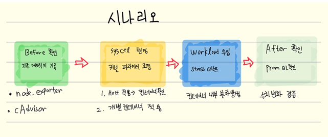

kernel parameter -> /proc/sys
https://somaz.tistory.com/416

## 컨테이너는 Host의 kernel을 공유한다

### 목표 
저는 컨테이너를 사용하다면 가끔 "쉽고 편리한 VM"으로 종종 착각하곤 합니다.
하지만 kernel의 입장에서 cgroup / namespace / chroot 같은 kernel 기능들로 격리된 "컨테이너는 그저 특수한 조건으로 격리된 일반 프로세스" 일 뿐입니다.
따라서 전역 파라미터(Global Parameter)를 튜닝하게 되면 컨테이너들은 반드시 , 즉각적으로 이에 영향을 받습니다.
목적에 따라서 컨테이너에서만 적용되게 파라미터를 튜닝하기 위해서는 튜닝하고자하는 파라미터가 namespace 단위로 튜닝을 지원하는지 체크할 필요 역시 있습니다.

본 실습의 목적은 컨테이너가 Host 커널을 공유한다는 사실을 단순 확인하는 것을 넘어,

1. 커널 전역 파라미터(Global sysctl)의 변경이 컨테이너 워크로드에 미치는 영향을 metric으로 측정하고,
2. namespace 기반으로 격리되는 파라미터와 그렇지 않은 파라미터를 실험적으로 구분하며,
3. 해당 차이가 실제 서비스 성능 및 안정성에 미치는 영향을 유추해보는 것 

을 목표로합니다.

### 시나리오

2개의 모든 시나리오는 동일한 실행 패턴으로 설계합니다.

#### 시나리오 1 : 메모리 스왑 정책 튜닝 (전역 파라미터)

목표 : Memory swap 정책을 전역단위로 설정하고 컨테이너에 스트레스 테스트를 가함으로써 호스트와 컨테이너 양쪽의 Swapused 관측 
검증 가치 : 컨테이너의 독립성을 맹신하다가 호스트 전체가 느려지는 현상(noisy neighboor)의 이해 및 검증
단계

Before 수집
파라미터 변경
워크로드 투입
After 확인

#### 시나리오 2 : Net namespace 스코프 파라미터 튜닝 (Namespace 파라미터)

목표 : --sysctl 플래그로 컨테이너별로 다른 값을 주입해서, 같은 호스트 위에서 컨테이너 A와 B의 메트릭이 서로 다르게 나오는 것을 관찰
검증 가치 : 성능 최적화가 필요한 특정 애플리케이션만 호스트 영향 없이 튜닝할 수 있는가?의 검증

Before 수집
파라미터 변경
워크로드 투입
After 확인